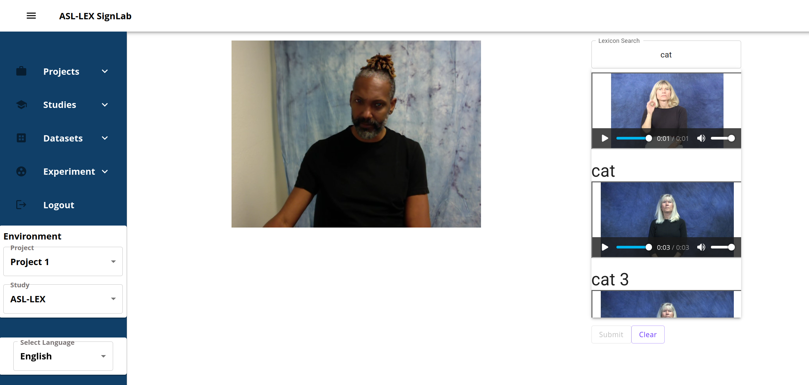
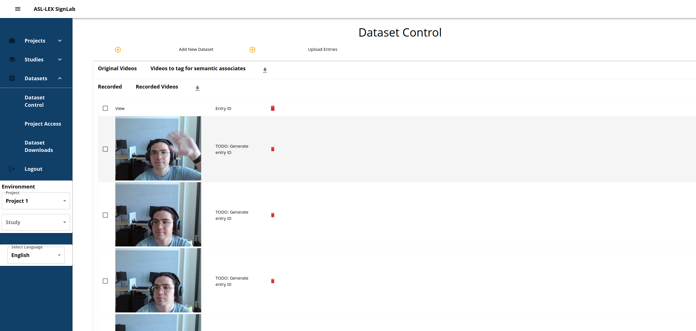
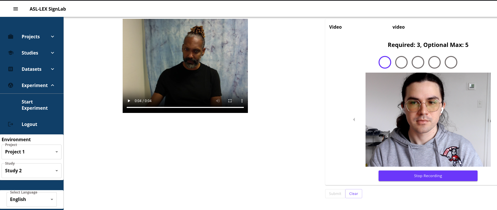

# SignTag

SignTag is a sign language focused data labeling platform. SignTag allows researchers to upload and annotate still images and videos with researcher defined fields. The labels can be made up of text, numeric, recorded videos, and uniquely identified sign language tokens (lexicon labeling). The ability to label data both with videos and with a sign lexicon allows sign language researchers to label sign language data with sign language, removing the frequently used approach of labeling with text of a spoken language.

## High Level Features

### Datasets

Datasets in SignTag provide you a way to create re-usable sets of videos and images for labeling. Datasets can be labeled multiple times and in different ways making it easy to repeat studies, extract additional features, or use your data in totally new studies. You can either upload existing data or record your own from within SignTag itself.

### Studies

A "study" is a round of data labeling in the SignLex platform. As the researcher, you can select what data to label from your datasets. You can combine data from different datasets as well as label subsets of your datasets. You then select how you want the data labeled. This can be with text, numbers, but most commonly with video or lexicon labels. Shown above is a video being labeled with between 3-5 videos. Lexicon labeling shown at the top allows you to label videos with supported "Sign Lexicons" which are databases of uniquely identified signs for specific languages.

## Running SignTag Yourself

