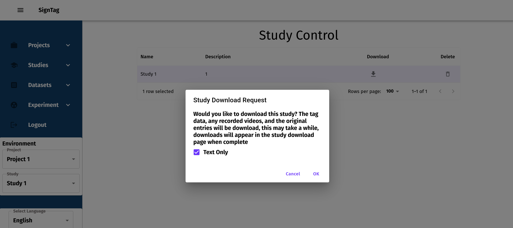
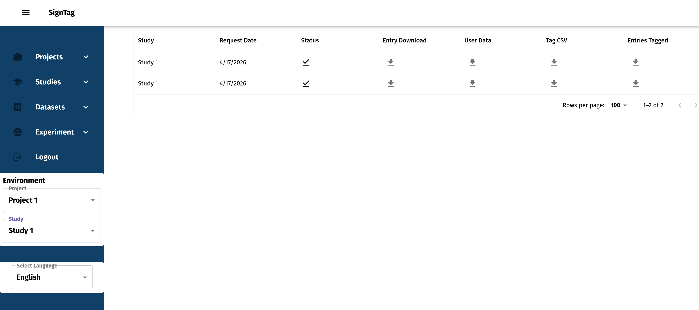

# Introduction

This script is a helper for bulk downloading content from GCP. The script takes in a JSON file of entries that include the information where in the bucket the file is located. The script will also skip over files that are already downloaded.

# Instructions

## Step 1. Download and Install `gcloud`

Follow the instructions from Google on installing gcloud: https://docs.cloud.google.com/sdk/docs/install-sdk

## Step 2. Select the Corresponding GCP Project

Run the command below to set the correct GCP project

```
gcloud config set project PROJECT_NAME
```

Where `PROJECT_NAME` name maps based on the table.

| Region   | Project Name       |
| -------- | ------------------ |
| Europe   | signlab-eu-prod    |
| US - Dev | signlab-us-prod    |
| US - Dev | signlab-dev-417814 |

## Step 3. Collect Assets from SignTag

Navigate to the Study Control page as you normally would to download. This time select the "Text Only". This will export the tag CSV and the list of entries instead of a zip of the entries.



Now you can go through the normal process of downloading each portion. This time the "Entry Download" and "Entires Tagged" for your download request will be JSON files containing the list of videos



## Step 4. Using the Download Script

1. Install the packages in this folder `pip install -r requirements.txt`
2. Run the download utility

```
python entry-download.py BUCKET_NAME ENTRY_FILE OUTPUT_FOLDER
```

| Field         | Description                                                  |
| ------------- | ------------------------------------------------------------ |
| BUCKET_NAME   | The bucket associated with your organization. Ask Collin Bolles for clarification |
| ENTRY_FILE    | This is the path to your downloaded entry file. You will have two. One for the entries generated in the study and the second for the entries that were being labeled. |
| OUTPUT_FOLDER | This is the folder where the entries will be saved.          |

For example

```
python entry-download.py sample-bucket ~/Downloads/entries.json ~/assets/signlex/signtag/downloads/entries
```
